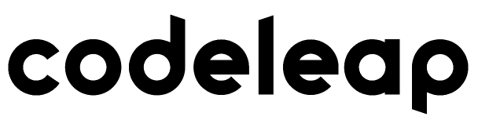

  

CodeLeap - NetWork | Online here: <a href="https://codeleap.netlify.app/">Link</a>

 
 

## Getting started

- Run

> install dependencies with your package manager (npm, yarn or pnpm)

> run `npm run dev` or `yarn dev` or `pnpm run dev

## Features

[//]: # "Add the features of your project here:"

Some features used in the Project.

- **<a href="https://vitejs.dev/" target="_blank">ViteJS</a>**

- **<a href="https://react-hook-form.com/" target="_blank">React Hook Forms</a>**

- **<a href="https://www.npmjs.com/package/react-icons" target="\_blank">React Icons</a>**

- **<a href="https://www.radix-ui.com/" target="_blank">Radix UI</a>**

- **<a href="https://www.npmjs.com/package/react-toastify" target="_blank">React Toastify</a>**

- **<a href="https://redux-toolkit.js.org//" target="_blank">Redux Toolkit</a>**

- **<a href="https://reactrouter.com/en/main" target="_blank">React Router Dom</a>**

- **<a href="https://zod.dev/" target="_blank">Zod</a>**

You can see more dependencies in `package.json` file.

### - LICENSE

This project is licensed under the MIT License - see the <a href="https://opensource.org/licenses/MIT" target="_blank">LICENSE</a> page for details.
